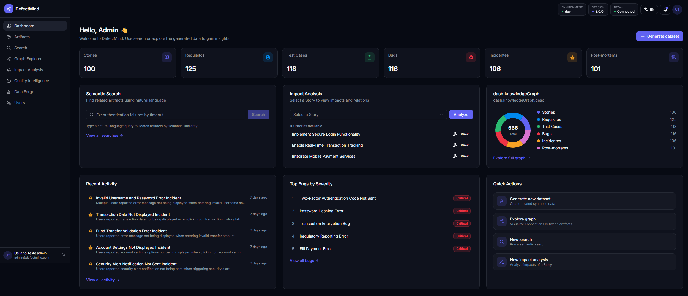
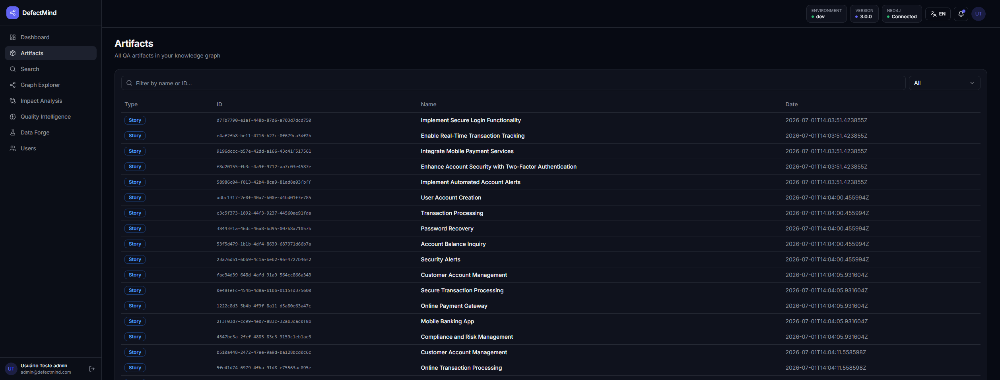
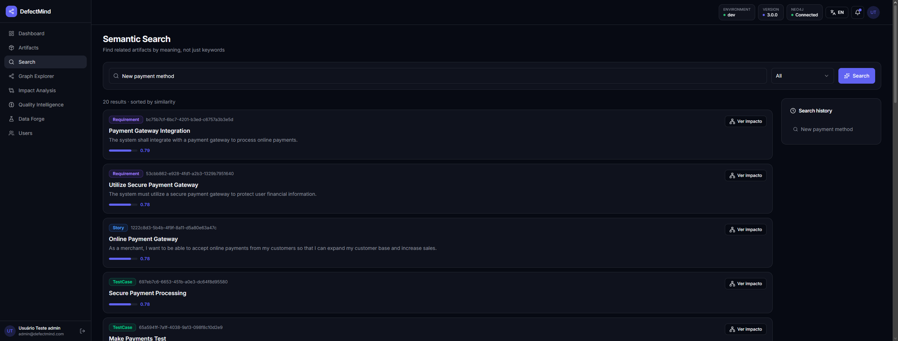
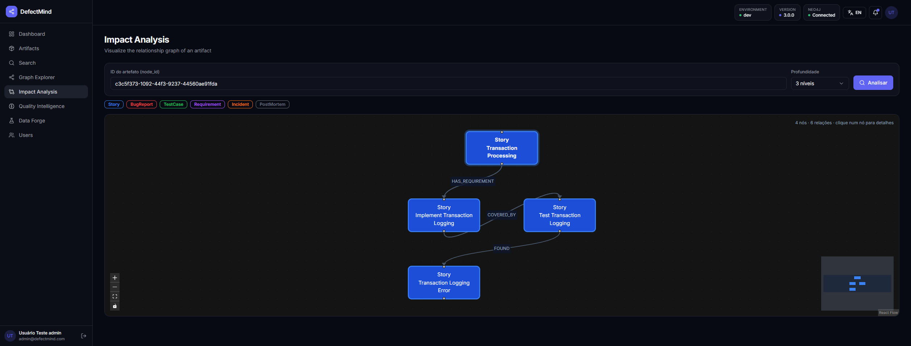
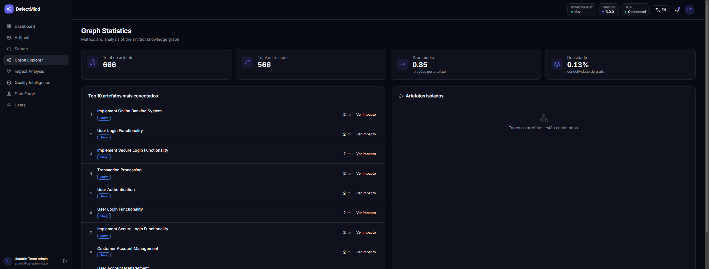
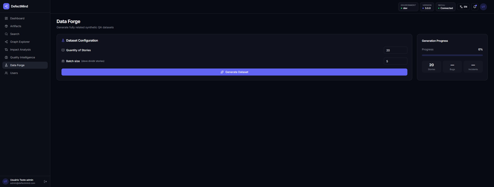
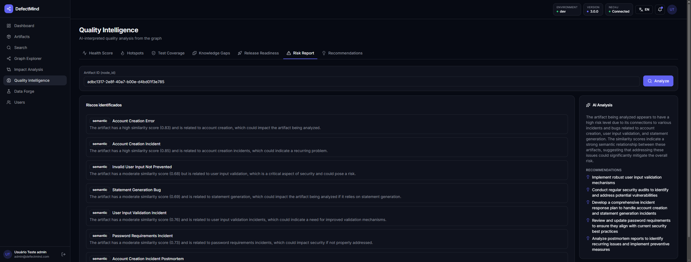
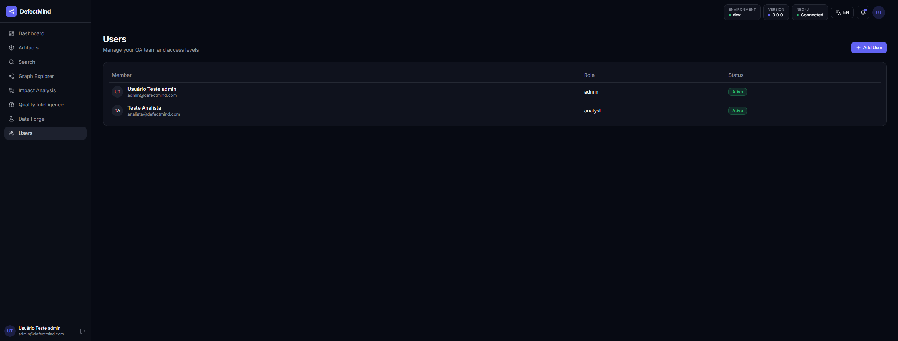

# DefectMind

**Inteligência para QA, orientada por grafos e IA.**

DefectMind é uma plataforma de QA intelligence que modela artefatos de qualidade (Stories, Requirements, TestCases, BugReports, Incidents e PostMortems) como um grafo de conhecimento no Neo4j, com busca semântica por embeddings e um módulo de análises interpretadas por LLM — Health Score, Quality Hotspots, Test Coverage Analysis, Knowledge Gaps, Release Readiness, Quality Risk Report e Recommendations Engine.

Os próprios artefatos que povoam o grafo são **gerados por IA**: o Data Forge usa um LLM pra inventar Stories, Requirements, TestCases, BugReports, Incidents e PostMortems coerentes entre si e já conectados pelas relações corretas, criando rapidamente um dataset realista pra explorar todas as funcionalidades da plataforma.



---

## Índice

- [Funcionalidades](#funcionalidades)
- [Screenshots](#screenshots)
- [Stack técnica](#stack-técnica)
- [Arquitetura](#arquitetura)
- [Como rodar](#como-rodar)
  - [Via Docker Compose](#via-docker-compose-recomendado)
  - [Backend local](#backend-local)
  - [Frontend local](#frontend-local)
- [Variáveis de ambiente](#variáveis-de-ambiente)
- [Testes e qualidade](#testes-e-qualidade)
- [Documentação da API](#documentação-da-api)
- [Estrutura do projeto](#estrutura-do-projeto)
- [Licença](#licença)

---

## Funcionalidades

**Grafo de artefatos de QA** — CRUD completo para Story, Requirement, TestCase, BugReport, Incident e PostMortem, com relacionamentos explícitos entre eles (`HAS_REQUIREMENT`, `COVERED_BY`, `FOUND`, `CAUSED`, `ROOT_CAUSE`).

**Busca semântica** — busca por significado (não só por palavra-chave) usando embeddings (`sentence-transformers`, 384 dimensões) e índices vetoriais nativos do Neo4j.

**Análise de impacto** — travessia do grafo a partir de um artefato pra visualizar tudo que seria afetado por uma mudança, com profundidade configurável.

**Data Forge** — geração de datasets de QA **por IA**: um LLM inventa Stories, Requirements, TestCases, BugReports, Incidents e PostMortems realistas e já interligados pelas relações corretas do grafo, em lote e em segundos — não é dado aleatório, é conteúdo coerente o suficiente pra alimentar as análises de Quality Intelligence de forma significativa.

**Quality Intelligence** — 7 funcionalidades analíticas com interpretação por IA, sempre restrita às evidências coletadas do grafo (sem alucinação de dados fora do contexto):

| Funcionalidade | O que faz |
| :--- | :--- |
| **Health Score** | Classifica o risco de um artefato (LOW/MEDIUM/HIGH) a partir da vizinhança dele no grafo. |
| **Quality Hotspots** | Ranqueia as Stories com maior concentração de defeitos no grafo inteiro. |
| **Test Coverage Analysis** | Calcula um coverage score e identifica Requirements sem TestCase, Stories sem cobertura funcional e TestCases órfãos. |
| **Knowledge Gaps** | Detecta falhas de rastreabilidade: bugs sem TestCase, incidents sem postmortem, requirements sem story e vice-versa. |
| **Release Readiness** | Avalia se um conjunto de Stories está pronto pra release (`READY`/`NEEDS_ATTENTION`/`NOT_READY`), com lista de blockers. |
| **Quality Risk Report** | Combina busca estrutural no grafo com busca semântica por artefatos parecidos com histórico de problemas. |
| **Recommendations Engine** | Gera recomendações tipadas e priorizadas de ação, sempre com justificativa. |

## Screenshots

> Adicione os prints em `docs/screenshots/` com os nomes de arquivo abaixo — os links já estão prontos, só falta o arquivo existir.

| Dashboard | Artefatos |
| :---: | :---: |
|  |  |

| Busca Semântica | Análise de Impacto |
| :---: | :---: |
|  |  |

| Explorador de Grafo | Data Forge |
| :---: | :---: |
|  |  |

| Quality Intelligence | Usuários |
| :---: | :---: |
|  |  |

## Stack técnica

**Backend**
- [FastAPI](https://fastapi.tiangolo.com/) — API REST
- [PostgreSQL](https://www.postgresql.org/) + SQLAlchemy + Alembic — dados relacionais (usuários/autenticação)
- [Neo4j](https://neo4j.com/) — grafo de artefatos de QA e busca vetorial
- [sentence-transformers](https://www.sbert.net/) (`all-MiniLM-L6-v2`) — embeddings
- JWT — autenticação
- Provedores de IA plugáveis: Gemini, DeepSeek ou Groq (selecionável via `AI_PROVIDER`)

**Frontend**
- [TanStack Start](https://tanstack.com/start) (React 19) — SSR + roteamento file-based
- [TanStack Query](https://tanstack.com/query) — data fetching e cache
- [Tailwind CSS 4](https://tailwindcss.com/) + [shadcn/ui](https://ui.shadcn.com/) (Radix) — UI
- [React Flow](https://reactflow.dev/) — visualização do grafo de impacto

**Infra**
- Docker Compose — orquestra backend, frontend, Postgres e Neo4j
- GitHub Actions — lint (`ruff`), testes (`pytest`) e build das imagens Docker em todo push/PR pra `main`

## Arquitetura

```
Story ──HAS_REQUIREMENT──▶ Requirement ──COVERED_BY──▶ TestCase ──FOUND──▶ BugReport ──CAUSED──▶ Incident ──ROOT_CAUSE──▶ PostMortem
```

Cada artefato é um nó no Neo4j com um `id` (UUID) próprio da aplicação e um embedding de 384 dimensões gerado a partir do seu conteúdo. O módulo `quality_intelligence` do backend combina consultas estruturais nesse grafo com chamadas a um LLM, sempre com instrução estrita de responder só a partir dos dados coletados.

## Como rodar

### Via Docker Compose (recomendado)

```bash
cp .env.example .env
# preencha o .env com as credenciais desejadas
docker-compose up --build
```

| Serviço | URL |
| :--- | :--- |
| Frontend | http://localhost:3000 |
| Backend (API) | http://localhost:8000 |
| Backend (Swagger) | http://localhost:8000/docs |
| Neo4j Browser | http://localhost:7474 |

### Backend local

```bash
pip install -r requirements.txt
uvicorn backend.src.main:app --reload
```

> Comandos rodados a partir da raiz do repositório — os imports do backend são baseados em `backend.src.*`.

### Frontend local

```bash
cd frontend
npm install
npm run dev
```

## Variáveis de ambiente

Copie `.env.example` para `.env` e preencha:

| Variável | Descrição |
| :--- | :--- |
| `ENVIRONMENT`, `APP_NAME`, `APP_VERSION` | Metadados da aplicação |
| `POSTGRES_USER`, `POSTGRES_PASSWORD`, `POSTGRES_DB` | Credenciais do Postgres |
| `JWT_SECRET_KEY`, `JWT_ALGORITHM`, `JWT_ACCESS_TOKEN_EXPIRE_MINUTES` | Configuração do JWT |
| `NEO4J_URI`, `NEO4J_USER`, `NEO4J_PASSWORD` | Conexão com o Neo4j |
| `GEMINI_API_KEY` / `DEEPSEEK_API_KEY` / `GROQ_API_KEY` | Chave do provedor de IA escolhido |
| `AI_PROVIDER` | Seletor do provedor ativo (`gemini`, `deepseek` ou `groq`) |
| `VITE_API_URL` | URL da API usada pelo frontend (opcional — tem fallback automático) |

## Testes e qualidade

```bash
# Backend
pytest backend/src/tests/ -v
ruff check backend/src/

# Frontend
cd frontend
npm run lint
```

Os testes de backend nunca tocam num banco real: env vars obrigatórias são definidas antes de qualquer import do projeto, `get_db` é substituído por uma sessão SQLite em memória, e `get_neo4j_session` por uma sessão fake.

## Documentação da API

Com o backend rodando, a documentação interativa (Swagger UI) fica disponível em `/docs`, e o schema OpenAPI em `/openapi.json`.

## Estrutura do projeto

```
DefectMind/
├── backend/
│   └── src/
│       ├── core/            # config, banco de dados, Neo4j, auth, embeddings, provedores de IA
│       ├── modules/         # auth, users, artifacts, data_forge, search, quality_intelligence
│       ├── infra/alembic/   # migrações do Postgres
│       └── tests/           # testes unitários e de integração
├── frontend/
│   └── src/
│       ├── routes/          # rotas file-based (TanStack Router)
│       ├── components/      # componentes de UI (app-layout, ui/ shadcn)
│       └── lib/              # cliente de API, i18n, utils
├── docs/
│   └── screenshots/          # prints usados neste README
└── docker-compose.yaml
```

## Licença

Distribuído sob a licença [MIT](LICENSE).
